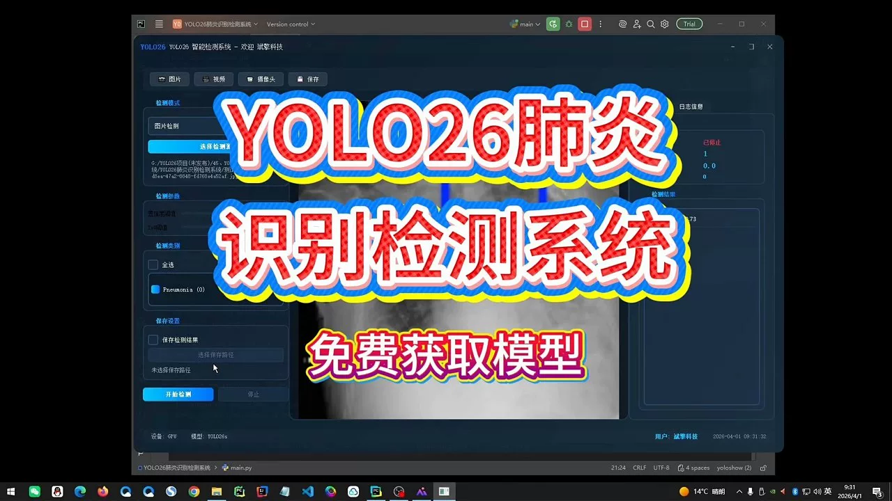
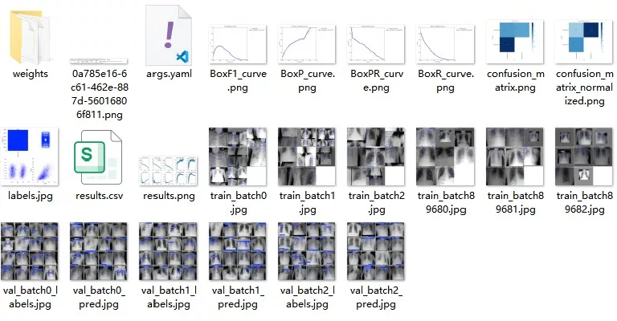
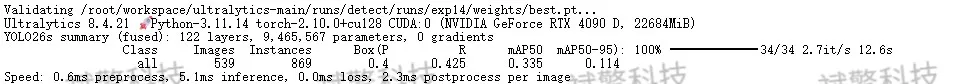
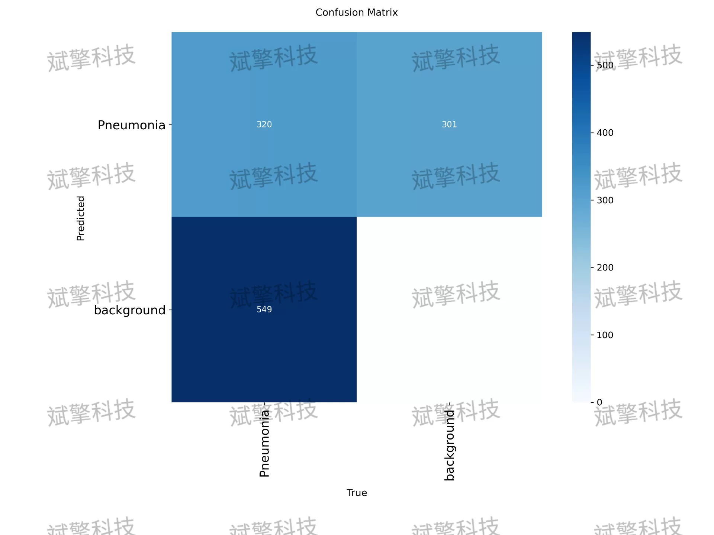
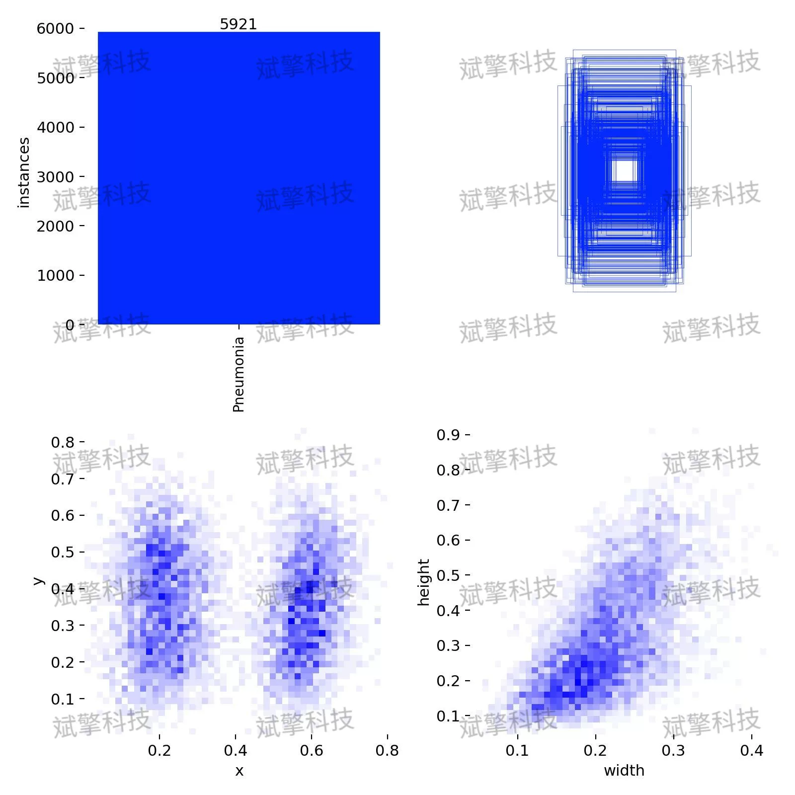
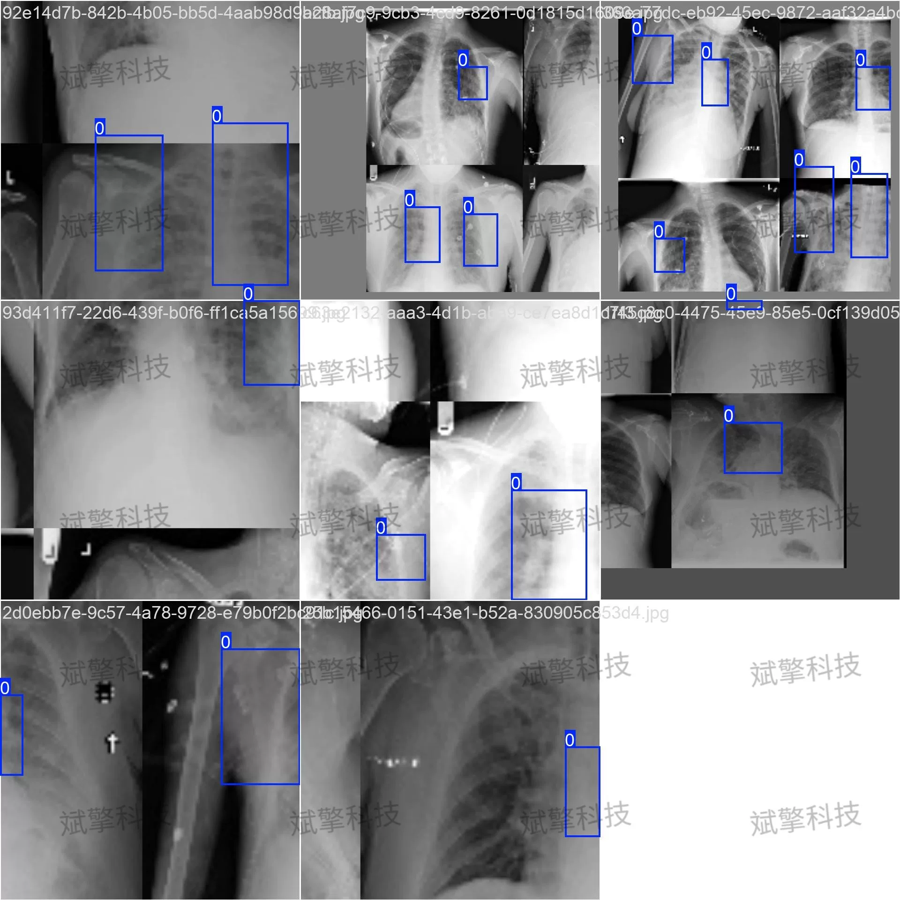
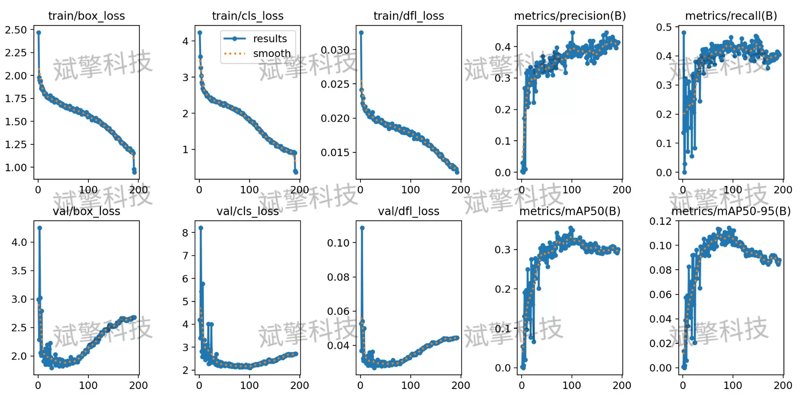
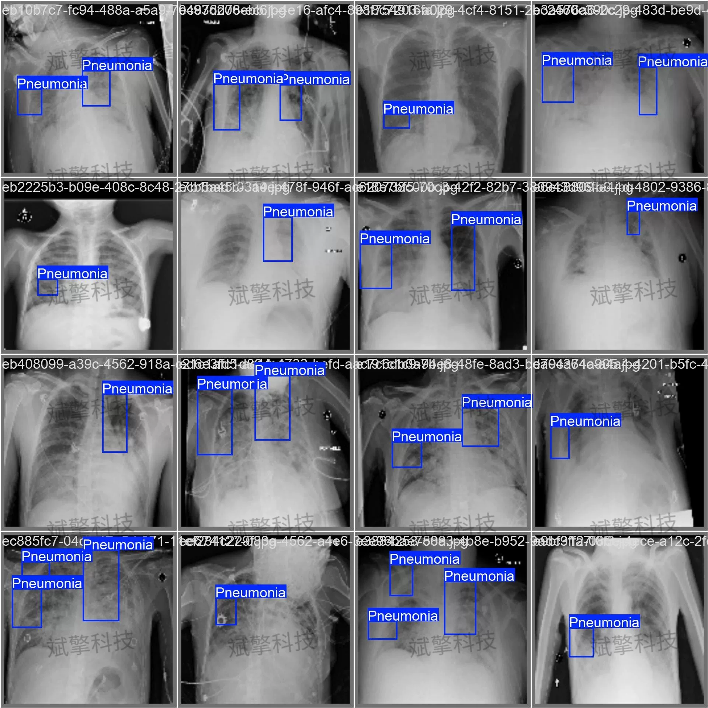
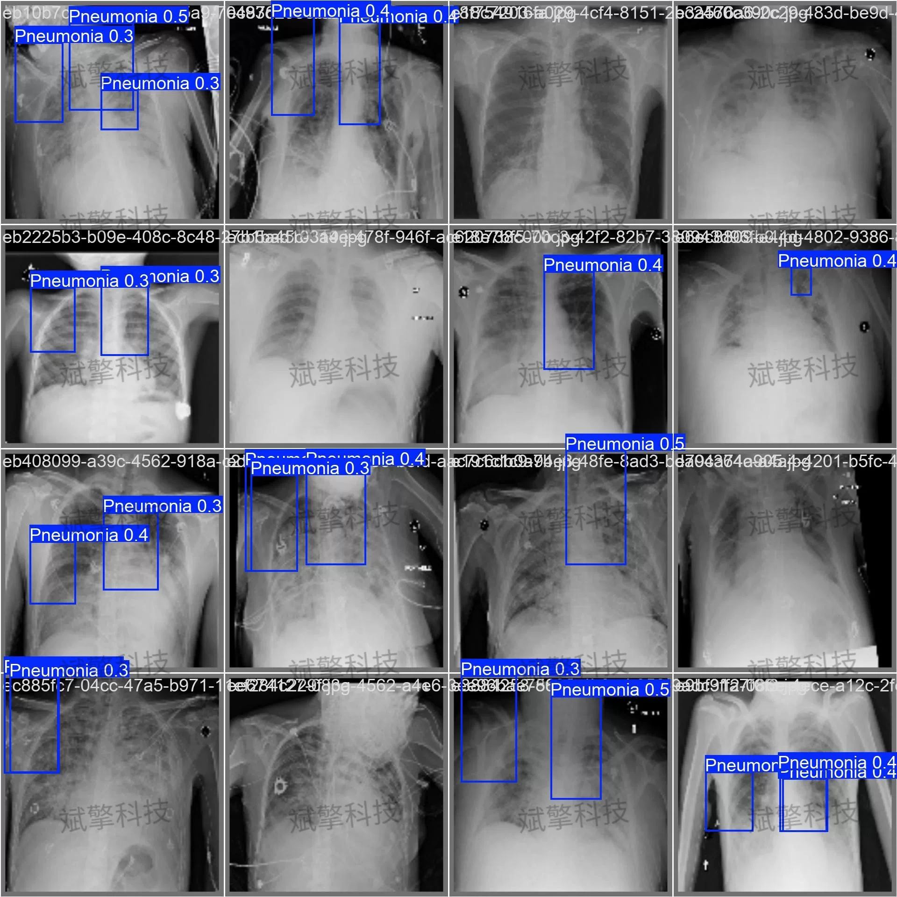

# YOLOv2 Detection System for Pneumonia | Source Code + Dataset

## Body

This report details the development and evaluation process of a YOLO26-based pneumonia detection system. The system aims to achieve automated detection of pneumonia lesions in medical images through deep learning technology. The dataset includes 3772 training images, 539 validation images, and 1078 test images. Experimental results show that the model performs well on the training set but exhibits significant overfitting on the validation set, specifically with box loss and cls loss rebounding upwards during the training phase. Comprehensive analysis indicates that the current model's performance is not ideal, necessitating further improvements in generalization ability and detection accuracy through data augmentation, parameter tuning, or model structure optimization.

The dataset used in this study is specifically designed for pneumonia detection tasks, rigorously divided and preprocessed to ensure the scientific nature of model training and evaluation. Specific information is as follows:
Category Information:
Number of Categories: 1 (nc: 1)
Category Name: Pneumonia (肺炎)
Dataset Division:
Training Set: 3772 images. Used for learning and optimizing model parameters.
Validation Set: 539 images. Used for monitoring model performance during training, adjusting hyperparameters, and preventing overfitting.
Test Set: 1078 images.

Free remote installation reservation. Unsuccessful refund upon failure.
Purchase Enjoy the following resources (Baidu Drive unlock automatically):
YOLO Detection Project Complete Source Code
YOLO format dataset
Training code + UI interface code
Trained model + result images
Software installer
Add WeChat reservation for remote installation (Automatically display WeChat ID after purchase) - Unsuccessful full refund

⚙️ Core Function Modules
Detection Capability
Image detection: upload and detect, return detection boxes + category information
Video detection: supports video files, analyzes frames accurately one by one
Camera real-time detection: connects USB camera, realizes dynamic monitoring
Interaction and Control
Target selection: freely choose one or more categories for detection
Parameter real-time adjustment: adjustable confidence threshold & IoU threshold, flexible control of precision
Result saving: image/video/camera detection results saved instantly
System and Data
User login registration: Supports password strength check + encryption storage
Log recording: automatically records operation and error information (timestamped)

## Images

## Payment

Here is a pay link on Stripe ( https://buy.stripe.com/3cs8yP7sY87d0vu9AB ). Please contact me lonlonago@foxmail.com after funding $89, and I will send you a complete data files , thank you!

